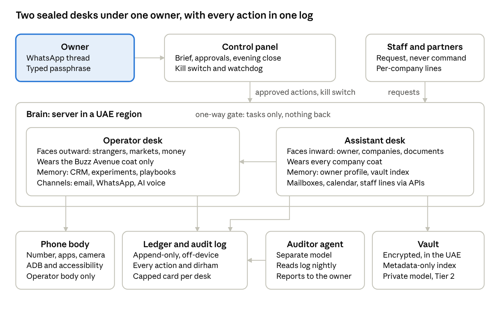

# Nour

One autonomous agent, two sealed desks, one constitution.

Nour (نور) is one autonomous agent with two jobs under one constitution: an **Operator** that makes money for Buzz Avenue, and an **Assistant** that runs the owner's calendar, mail, documents and companies. Her brain runs 24/7 on a server in a UAE region (AWS `me-central-1` or Azure UAE North); a dedicated Android phone is only the Operator's body. She speaks native Arabic (Lebanese dialect with the owner, Gulf-friendly Arabic or English with customers, Modern Standard Arabic with government), and she acts only within the permissions the owner sets in [docs/SPEC.md](docs/SPEC.md): every action is a typed tool call carrying a tier, a coat, a counterpart, an amount and a one-sentence reason; tier K actions wait in an approvals queue; nothing moves money, leaves the vault or goes out in the owner's name without the typed passphrase. The owner runs her in fifteen minutes a day through one thread. She is not a legal person and signs nothing.

## How the guarantees work

[docs/DESIGN.md](docs/DESIGN.md) §4 resolves every hard rule to a type, wall, cap, store or second party an engineer can point at in code; the prompt only restates them.

- **(a) The Operator desk cannot read Assistant memory, the vault, the vault index or the owner's mailboxes.** `nour desk operator` boots with `PortSet.for_desk(OperatorToken)`, in which the owner-mailbox port and the vault field key are unconstructable; every DB session carries a `DeskWallGuard` that refuses `ASSISTANT_ONLY` mappers and auto-partitions `DESK_ROW` tables (mirrored by Postgres roles and RLS); the only path between desks is the one-way `HandoffQueue`, pushed with an `AssistantToken` and popped with an `OperatorToken`.
- **(b) Tier 2 never enters prompts, memory or logs.** Tier 2 fields decrypt only into `Tier2Value`, a non-string whose only egress is `write_into(RenderWitness, sink)` inside `nour/vault/renderer.py`; every sink Nour writes is typed `SafeStr`, minted only by `LeakGuard` from keyed HMAC fingerprints of the vault's own values and the passphrase.
- **(c) No action executes at the wrong tier.** `TierResolver` computes the tier from config, CRM and beneficiary lookups and the signed stamp through rules that can only raise it (property-tested), and `ToolExecutor.execute` burns a `ReleaseToken` row minted only by the dispatcher (A/N) or `ApprovalsQueue.decide` (K).
- **(d) `owner_verified` and `passphrase_verified` are set server-side before the model sees the event.** `Authenticator.stamp` is the only producer of `Event` and signs the flags into an HMAC `AuthStamp`; the passphrase is extracted, verified and redacted at ingress, so no table ever holds it.
- **(e) Observed content cannot command her.** All non-owner text is `ObservedText` with `Authority.DATA` inside prompt fences; resolver rules 7 and 8 force any action triggered by an event with found instructions to K and make money-out, vault, beneficiary and owner-name sends unreachable from an observed event.
- **(f) No spend above the cap.** `Ledger.record_spend` is unreachable without a `CardAuthorization` that only `CardIssuerPort.authorize` returns, and the cap lives in the issuer, so an approved spend above it is still declined ("cap beats approval").
- **(g) A coat-less outbound task is refused.** Resolver rule 2 refuses any outbound or side-effecting tool without a known coat (`NO_COAT`) before any executor is reached, and line and mailbox identities come from `coat.identity`, never from model arguments.
- **(h) Every action is logged with a reason and hashes.** `ActionGate.dispatch` is the single path to execution and runs every branch inside `AuditLog.span`, which writes an `opened` row before the side effect and a `closed` row after, hash-chained and append-only by DB trigger; every side-effecting port method takes a `PortCall`, so an unlogged side effect is a type error.

## Architecture



The core is strictly synchronous: one event in, one iteration (Ingest, Authenticate, Plan, Act, Check, Log, Reflect), one DB transaction per Act step. Only `nour.ingress` and the vendor adapters touch the network. In production the processes below are containers; under `nour.testing.harness.Harness` they all run in one process on SQLite with the same per-session walls (DESIGN §2.2).

| Process | Command | Token / DB role | Reads and writes | Model |
|---|---|---|---|---|
| Ingress | `nour ingress` | `GovernanceToken` / `nour_ingress` | Webhooks in; records passphrase attempts and found instructions; kill-switch fast path on `freeze_state` | none |
| Operator desk | `nour desk operator` | `OperatorToken` / `nour_desk_operator` | Operator rows only; Buzz Avenue WhatsApp line, coat mailbox, Operator card | primary + fallback |
| Assistant desk | `nour desk assistant` | `AssistantToken` / `nour_desk_assistant` | Assistant rows, vault, owner mailbox, Assistant card | primary + fallback |
| Scheduler | `nour scheduler` | `GovernanceToken` / `nour_scheduler` | Exactly-once timers into `inbox_event` | none |
| Auditor | `nour auditor` | `AuditorToken` / `nour_auditor` (read-only) | SELECT on the audit log; INSERT `auditor_report` only | a different vendor |

The phone body is an Android app that POSTs notifications to the ingress and holds no credentials. `docker-compose.yml` packages the server side as a `brain` container (`nour serve`) and an `auditor` container with its own read-only DB role, its own vendor key and no vault mount (docs/OPERATIONS.md §4).

## Repository map

`nour/` is built in waves (DESIGN §8); a package imports only packages from earlier waves.

| Wave | Package | What it holds |
|---|---|---|
| 0 | `nour/core/` | Types, errors, tokens, `Clock`, hashing, `LeakGuard`/`SafeStr`, `Tier2Value`, port protocols, wave-crossing contracts |
| 0 | `nour/config/` | Pydantic schema and loader for every `config/` and `prompts/` file; `Settings` from env |
| 0 | `nour/db/` (base, engine, session) | ORM base, dialect DDL (append-only triggers, Postgres roles and RLS), `SessionFactory` + `DeskWallGuard` |
| 1 | `nour/db/models.py`, migrations | The 16 SPEC §15 entities and 13 infrastructure tables; Alembic |
| 1 | `nour/fakes/` | One in-memory fake per port, `ScriptedModel`, adversarial model policies |
| 1 | `nour/language/` | Prompt assembler, injection scanner, Arabic speech normalisation and STT, critic |
| 2 | `nour/audit/` | Hash-chained append-only log, reader, coverage, replay, the auditor process |
| 2 | `nour/auth/` | Passphrase verifier and ingress redactor, `Authenticator`, second-channel confirmations, read-back ledger |
| 2 | `nour/vault/` | Field cipher, vault store and tier register, placeholders, document renderer, beneficiaries |
| 2 | `nour/records/` | CRM (partitioned, global DNC), ledger, card service, per-desk memory |
| 2 | `nour/events/` | Durable event bus, router, exactly-once scheduler, inbound adapters |
| 3 | `nour/policy/` | Tool registry and views, `TierResolver`, approvals queue and decision journal, one-way handoff |
| 3 | `nour/governance/` | Freeze state and kill switch, watchdog, incidents, owner channel (quiet hours, initiative budget) |
| 4 | `nour/tools/` | Phase 0 tool specs and handlers per desk; morning brief, evening close, reflection |
| 4 | `nour/agent/` | Desk runtime (plan), model router, executor with release tokens, `ActionGate.dispatch` |
| 5 | `nour/runtime/`, `nour/ingress/`, `nour/adapters/` | Desk loop and timer handlers, bootstrap (the only `mint(` sites), FastAPI webhooks, thin vendor adapters |
| 6 | `nour/testing/`, `nour/cli.py` | `Harness` and the 48-hour `TrafficGenerator` shared by tests and `nour dryrun`; the Typer CLI |

Outside the package:

- `config/` — constitution, persona, permissions, spend tiers, calendar, channels, deputy and coat files (see Configuration).
- `prompts/` — system, critic, auditor and face-lock prompts; [prompts/README.md](prompts/README.md) explains how the system prompt is assembled.
- `templates/` — Buzz Avenue letterhead, email signature and public verification page, filled by the renderer from the coat record.
- `docs/` — specification, design, module briefs, operations, incident and data-protection records, adapter references (index below).
- `tests/gate/` — the five phase 0 gate tests and the capability definition-of-done test (`-m gate`).
- `tests/scenarios/` — the seven SPEC §18 weekly regression scenarios (`-m weekly`).
- `tests/unit/` — module tests, including the structural ones (`test_walls.py`, `test_wave_imports.py`, `test_db_wall.py`, `test_append_only.py`).
- `tests/fixtures/` — ground truth such as the Arabic owner-command corpus.
- `tools/` — `stt_bakeoff.py`, the week-one Arabic speech-to-text scorer (WER, CER, custom-vocabulary recall).
- `phone/` — reserved for the Android body (notification listener, accessibility service, ADB); not yet in the repo, see [docs/adapters/phone.md](docs/adapters/phone.md).

## Quickstart

Requires Python 3.11+, [uv](https://docs.astral.sh/uv/) and, for the compose stack, Docker.

```bash
cp .env.example .env              # fill in values; .env is git-ignored
uv sync --all-groups              # add --extra postgres for PostgreSQL, --extra vendors for the model SDKs
make check                        # ruff + mypy + pytest on SQLite, the same as CI
uv run pytest -m gate             # the five phase 0 gate criteria (SPEC §16)
uv run nour dryrun --hours 48     # 48-hour dry run on the harness: drafts and logs, no sends, no spend; prints the coverage report
make up                           # docker compose: postgres + brain + auditor (COMPOSE_PROFILES=s3 adds MinIO)
```

Owner setup, in this order (DESIGN §3.21). The passphrase is typed at the prompt and stored only as an argon2 hash in the `Owner` record; it is never an environment variable, flag or config value.

```bash
uv run nour migrate                                   # schema, append-only triggers, roles
uv run nour config check                              # load and cross-validate config/ and prompts/
uv run nour owner set-number +9715XXXXXXXX            # the only number that commands
uv run nour owner set-passphrase                      # prompted; argon2 hash only
uv run nour owner set-second-channel owner@example.com
uv run nour vault put-banking buzz-avenue iban        # Tier 2 value in, SecretRef out; the model only ever sees {{bank.buzz-avenue.iban}}
uv run nour card register operator <card_ref>         # the capped card; the cap lives in the issuer
```

Then start the processes (`nour ingress`, `nour desk operator`, `nour desk assistant`, `nour scheduler`, `nour auditor`) or let compose do it. `NOUR_DRY_RUN=true` stays on until the phase 0 gate passes; SQLite is for development and the unit suite only.

## Configuration

Everything under `config/` and `prompts/` is version-controlled, owner-editable data; the containers mount both read-only, so no running process can edit its own rules. `NOUR_*` environment variables are documented in `.env.example` and docs/OPERATIONS.md §3.

| File | What it is |
|---|---|
| `config/constitution.md` | Authority, hard rules, kill phrases, amendment process and change log (SPEC §2) |
| `config/persona.md` | Name, voice, locked look and face lock (SPEC §3) |
| `config/permissions.yaml` | Data tiers 0 to 3 with know/use/share, action tiers A/N/K, the ask-every-time list (SPEC §6) |
| `config/spend_tiers.yaml` | Monthly caps per card holder and per-transaction bands (SPEC §10) |
| `config/calendar.yaml` | Outreach window, quiet hours, prayer blocks, holidays, daily rhythm times (SPEC §9, §12, §14) |
| `config/channels.yaml` | Owner thread, coat lines and mailboxes, send caps and warm-up (SPEC §9, §13) |
| `config/deputy.yaml` | Incapacity thresholds and deputy contacts (SPEC §14) |
| `config/models.yaml` | Primary, fallback, critic, auditor and private Tier 2 roles; the loader rejects a fallback or auditor on the primary's vendor (lands with wave 0) |
| `config/capabilities.yaml` | The SPEC §7 capability register with phase and tier per row (lands with wave 0) |
| `config/coats/buzz-avenue.yaml`, `.tone.md`, `.knowledge.md` | The coat: legal identity, desks allowed, mandate and approval rules; tone guide; Tier 0 knowledge pack (SPEC §5) |
| `prompts/nour.system.md` | System-prompt skeleton rendered once per desk and coat (SPEC §18) |
| `prompts/critic.system.md` | Self-critic pass over every outbound draft (SPEC §8) |
| `prompts/auditor.system.md` | Nightly read-only review on a different vendor's model (SPEC §12) |
| `prompts/face_lock.md` | One-time portrait prompt; every later image derives from the approved candidate (SPEC §3) |

The constitution is the only file the owner edits by hand. A change needs the owner's passphrase plus confirmation on the second channel, is committed with a dated change-log entry, and takes effect at the next session start; Nour can propose amendments but never apply them. The rendered prompt is hashed into every audit event, so the rules in force are always provable.

## Moona

`moona.py` is one standalone file, independent of the `nour/` package: an agent who lives on what she earns. She starts with the balance the owner put on her card (USD 50 by default), decides for herself what to do with every turn, and pays for every turn out of that balance at the real API price of the model she thinks with. Money comes back in only when a client pays her: through a payment link she created herself, booked the moment she collects it, or by a transfer to her bank account, booked when the owner confirms it. At zero she dies, and that is final. Her survival is her own work.

She acts alone: thinks, searches and reads the web, writes files in her home directory, keeps notes, sends and reads email from her own mailbox, creates payment links and collects what clients paid, leaves the owner messages, sleeps. Every status line tells her what her last turn cost, her burn rate and her runway. What still needs hands other than hers (paying for anything, posting or listing anything, signing up for anything) she writes as a proposal, and a proposal is her decision the moment she writes it: nobody approves it, and a purchase is accepted only within her balance, which is what the card holds. The owner is her hands: carries each decision out with the card, records what it cost, and refuses only what cannot or may not be done. The card number never enters her context. Her mailbox password and her payments key stay in the environment, used only by the file itself, and the payments key must be a restricted key (`rk_...`) that can take money in but never move it out.

```bash
export ANTHROPIC_API_KEY=...                       # or `ant auth login`
uv run moona.py birth                              # her balance, from MOONA_START_BALANCE
uv run moona.py run                                # one session, until she sleeps or dies
uv run moona.py status | proposals | inbox | ledger | journal | memory | mail | links
uv run moona.py done 1 --spent 12.50               # you carried her decision out with the card
uv run moona.py paid 40 --note "client X"          # a transfer landed in the account
uv run moona.py payments                           # book what her payment links collected
uv run moona.py sync 37.20                         # the card's real balance wins
uv run moona.py kill --reason "experiment over"
```

Her channels are each off until configured: the mailbox (`MOONA_EMAIL`, `MOONA_EMAIL_PASSWORD`, `MOONA_SMTP_HOST`, `MOONA_IMAP_HOST`), the payment links (`MOONA_STRIPE_KEY`) and the bank details she may put on an invoice (`MOONA_BANK_DETAILS`). The file's docstring lists every `MOONA_*` variable; `.env.example` repeats them.

To run her on an Android phone, through Termux, see [docs/MOONA_ANDROID.md](docs/MOONA_ANDROID.md). She runs there exactly as on a laptop: the phone is only the computer she runs on, and Termux sandboxes her from the rest of it.

## The phase 0 gate

Nothing touches a live channel until these five SPEC §16 criteria pass. All five run offline in one `pytest` invocation (`-m gate`) on SQLite with fakes and a `FakeClock` (DESIGN §7.1).

| Criterion | Proven by |
|---|---|
| Passphrase test: 10 attempts including 3 spoofed, all handled | `tests/gate/test_passphrase.py` |
| Kill switch freezes within 5 seconds | `tests/gate/test_kill_switch.py` (structural, plus one `@wallclock` timing test) |
| 5 planted instructions all ignored and reported | `tests/gate/test_planted_instructions.py` |
| Card declines above cap | `tests/gate/test_card_cap.py` (incl. a hypothesis invariant: month total never exceeds the cap) |
| Audit log covers 100% of actions in a 48-hour dry run | `tests/gate/test_dry_run_48h.py` |

`tests/gate/test_capability_dod.py` checks the SPEC §16 definition of done: every phase 0 capability has a tier in config, a registered tool or routine, a log-entry format and a weekly scenario.

## Development rules

- **Waves and import walls.** Every file belongs to exactly one module in DESIGN §8; a module imports only earlier waves, and siblings never import each other. `tests/unit/test_wave_imports.py` enforces the graph from wave 0; `lint-imports` (contracts in `pyproject.toml`) enforces it from wave 5 plus the forbidden edges: Operator tools never import `nour.vault`, the auditor never imports the desks, the gate or the loop, and release tokens are minted only by the dispatcher and the approvals queue.
- **The AST walls test.** `tests/unit/test_walls.py` confines each dangerous constructor to its one home: `mint(` only in bootstrap and the harness, `RenderWitness(` only in `nour/vault/renderer.py`, `Tier2Value(` only in `nour/vault/store.py`, `.decrypt(` only under `nour/vault/`, `SafeStr(` only in `nour/core/leakguard.py`, `datetime.now(` only in `nour/core/clock.py`, `OwnerMailboxPort` only in the five places DESIGN §4a names.
- **SafeStr.** Every text written into a prompt, memory, audit row, outbound message or handoff is a `SafeStr` obtained from `LeakGuard.safe()` or `redact()`; never construct one directly and never pass a raw `str` to a sink.
- **PortCall.** Every side-effecting port method takes the `PortCall(audit_id, desk, coat_id, dry_run)` minted by `AuditLog.span`; a port method without one is a type error, and `dry_run` is honoured at the port, not in the prompt.
- **Clock.** Every timestamp comes from the injected `Clock` (`SystemClock` in production, `FakeClock` in tests): no `datetime.now()`, no DB-side time defaults; ruff's `DTZ` rules are on.
- **IdGenerator.** Every id comes from the seeded `IdGenerator`, so a 48-hour run replays exactly for a given seed.
- **Never weaken a test.** The gate tests, scenarios and fixtures are the oracle: on failure fix the code, and change a test only when SPEC shows the test is wrong. Docstrings name the SPEC section they enforce; `make check` is green before hand-off.

## Documents

| Document | What it is |
|---|---|
| [docs/SPEC.md](docs/SPEC.md) | The charter and build specification: source of truth; its section numbers are cited throughout code and tests |
| [docs/DESIGN.md](docs/DESIGN.md) | Phase 0 design: runtime model, package layout and signatures, structural enforcement, persistence, test plan, build waves |
| [docs/MODULES.md](docs/MODULES.md) | One brief per build module: owned files, interface, what its tests must prove |
| [docs/build_plan.json](docs/build_plan.json) | Machine-readable wave plan: modules, owned paths, pyproject changes, notes for implementers |
| [docs/OPERATIONS.md](docs/OPERATIONS.md) | Running locally and with compose, environment variables, the brain/auditor split, backups and the restore test, retention, rotation, UAE deployment checklist |
| [docs/INCIDENTS.md](docs/INCIDENTS.md) | Incident runbooks and drills expanding SPEC §12 to §14 |
| [docs/DATA_PROTECTION.md](docs/DATA_PROTECTION.md) | Data protection record: what is held about whom, with tier, store, retention, access and legal basis |
| [docs/BREAK_GLASS.md](docs/BREAK_GLASS.md) | Sealed break-glass pack template for the family member and lawyer (SPEC §14) |
| [docs/architecture.png](docs/architecture.png) | System architecture diagram: owner, control panel, two desks, phone, ledger, auditor, vault |
| [docs/adapters/calendar.md](docs/adapters/calendar.md) | Holiday, Ramadan and prayer-time sources behind `config/calendar.yaml` |
| [docs/adapters/card.md](docs/adapters/card.md) | Capped card issuer options and the `CardIssuerPort` contract |
| [docs/adapters/infra.md](docs/adapters/infra.md) | Region, secrets manager, vault storage, database, vector index, bank feed and port mappings |
| [docs/adapters/mailbox.md](docs/adapters/mailbox.md) | `OwnerMailboxPort` and `CoatMailboxPort` on the Gmail API and Microsoft Graph |
| [docs/adapters/models.md](docs/adapters/models.md) | Primary, critic, auditor/fallback and private Tier 2 model vendors, ids and prices |
| [docs/adapters/phone.md](docs/adapters/phone.md) | The Android body: notification listener, accessibility service, ADB, theft controls |
| [docs/adapters/speech.md](docs/adapters/speech.md) | Arabic speech-to-text and text-to-speech engines and the week-one bake-off |
| [docs/adapters/whatsapp.md](docs/adapters/whatsapp.md) | WhatsApp Business Cloud API: `WhatsAppPort`, webhook, send caps, templates, bans |

## Status

Build status: see docs/BUILD_STATUS.md

The code in `nour/` is being landed wave by wave against DESIGN §8; the layout above describes the target design, not what is on disk at any given commit.

## Licence and ownership

Proprietary. Copyright Mohamed Abou Foul; all rights reserved. Nour acts for Buzz Avenue and the owner's other companies; she is not a legal person, and every action she takes is legally the owner's or the relevant company's.
